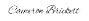

# Contributor Covenant Code of Conduct

## Our Pledge

We as members, contributors, and leaders pledge to make participation in our
community a harassment-free experience for everyone, regardless of age, body
size, visible or invisible disability, ethnicity, sex characteristics, gender
identity and expression, level of experience, education, socio-economic status,
nationality, personal appearance, race, caste, color, religion, or sexual
identity and orientation.

We pledge to act and interact in ways that contribute to an open, welcoming,
diverse, inclusive, and healthy community.

## Our Standards

Examples of behavior that contributes to a positive environment for our
community include:

* Demonstrating empathy and kindness toward other people
* Being respectful of differing opinions, viewpoints, and experiences
* Giving and gracefully accepting constructive feedback
* Accepting responsibility and apologizing to those affected by our mistakes,
  and learning from the experience
* Focusing on what is best not just for us as individuals, but for the overall
  Community

Examples of unacceptable behavior include:

* The use of sexualized language or imagery, and sexual attention or advances of
  any kind
* Publishing incomplete work or work that is not done with the highest quality

## Enforcement Responsibilities

Community leaders are responsible for clarifying and enforcing our standards of
acceptable behavior and will take appropriate and fair corrective action in
response to any behavior that they deem inappropriate, threatening, offensive,
or harmful.

Community leaders have the right and responsibility to remove, edit, or reject
comments, commits, code, wiki edits, issues, and other contributions that are
not aligned to this Code of Conduct, and will communicate reasons for moderation
decisions when appropriate.

## Scope

This Code of Conduct applies within all community spaces, and also applies when
an individual is officially representing the community in public spaces.
Examples of representing our community include using an official e-mail address,
posting via an official social media account, or acting as an appointed
representative at an online or offline event.

## Enforcement

Instances of abusive, harassing, or otherwise unacceptable behavior may be
reported to the professor and TAs at uricsc305@gmail.com
All complaints will be reviewed and investigated promptly and fairly.

All community leaders are obligated to respect the privacy and security of the
reporter of any incident.

## Enforcement Guidelines

Community leaders will follow these Community Impact Guidelines in determining
the consequences for any action they deem in violation of this Code of Conduct:

### 1. Correction

**Community Impact**: Use of inappropriate language or other behavior deemed
unprofessional or unwelcome in the community.

**Consequence**: A private, written warning from community leaders, providing
clarity around the nature of the violation and an explanation of why the
behavior was inappropriate. A public apology may be requested.

### 2. Warning

**Community Impact**: A violation through a single incident or series of
actions.

**Consequence**: A warning with consequences for continued behavior. No
interaction with the people involved, including unsolicited interaction with
those enforcing the Code of Conduct, for a specified period of time. This
includes avoiding interactions in community spaces as well as external channels
like social media. Violating these terms may lead to a temporary or permanent
ban.

### 3. Temporary Ban

**Community Impact**: A serious violation of community standards, including
sustained inappropriate behavior.

**Consequence**: A temporary ban from any sort of interaction or public
communication with the community for a specified period of time. No public or
private interaction with the people involved, including unsolicited interaction
with those enforcing the Code of Conduct, is allowed during this period.
Violating these terms may lead to a permanent ban.

## Decisions
*Majority vote
*in a tie, we will hold a short meeting weighing the pros and the cons.

## Attendance
*Attend all meetings and project sections. If a member cannot attend, inform group members ahead of time if you cannot make it to a meeting.
*Weekly Scrum meeting at noon on Friday via Zoom
*Reasons for missing: Any acceptable reason for not being able to attend.
*If a member misses a meeting they should contact the group chat to be provided with the information they missed

## Assignments
Planning and given assignments to be decided by group members, and then confirmed by SCRUM master

## Participation
Everyone is expected to participate in conversations, meetings, and weekly assignments, along with the programming required for designing the app. If participation is lacking for certain group members, let the teaching staff know, and also remind them that participation is mandatory. 

## Agenda and Notes
Each meeting, the person responsible for taking notes will rotate every time. If there is ever a discrepancy between who is taking notes, the SCRUM Master will assign who will take notes.

Everyone should have an idea of what the agenda is before the meeting and should bring a few ideas to the meeting. This allows us to make sure we aren’t wasting time during the meeting thinking of ideas since we didn’t prepare. 

## Promptness
Every member of the team should be on time for the meeting. We are flexible - if someone is running late, simply let the other members know by texting within the group chat. If you cannot make a meeting, let the group know in advance, preferably 24 hours before the start of the meeting.

## Conversational Courtesy
Every member should listen to other members of the group, allowing for their input. Conversations should be professional, especially during meeting times. 

## Enforcement/Feedback
Each member is encouraged to provide feedback on any work completed for the group. If there is ever a disagreement about the work/feedback, there should be a meeting with the members, the SCRUM Master, and possibly even the teaching staff. Enforcement of rules should be similar to other group work completed in other classes. If someone is slacking, let SCRUM Master and teaching staff know. 

## Attribution

This Code of Conduct is adapted from the [Contributor Covenant][homepage],
version 2.1, available at
[https://www.contributor-covenant.org/version/2/1/code_of_conduct.html][v2.1].

Community Impact Guidelines were inspired by
[Mozilla's code of conduct enforcement ladder][Mozilla CoC].

For answers to common questions about this code of conduct, see the FAQ at
[https://www.contributor-covenant.org/faq][FAQ]. Translations are available at
[https://www.contributor-covenant.org/translations][translations].

[homepage]: https://www.contributor-covenant.org
[v2.1]: https://www.contributor-covenant.org/version/2/1/code_of_conduct.html
[Mozilla CoC]: https://github.com/mozilla/diversity
[FAQ]: https://www.contributor-covenant.org/faq
[translations]: https://www.contributor-covenant.org/translations

## SIGNATURES

